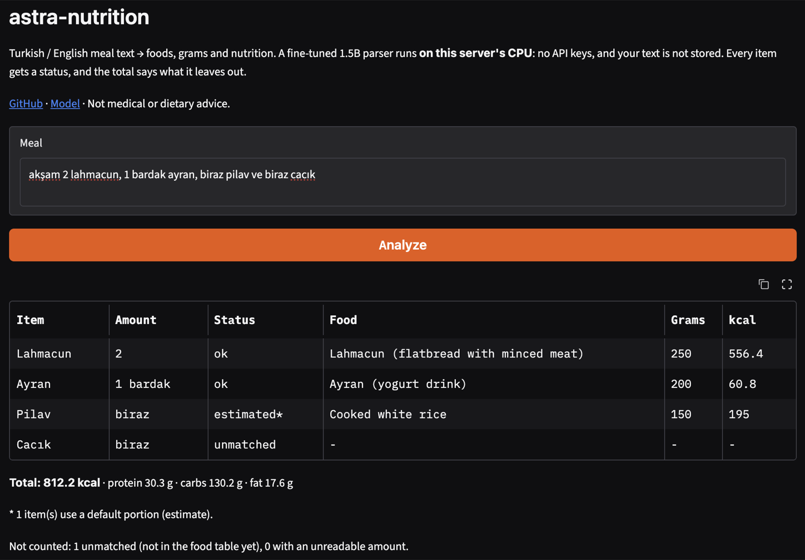

# astra-nutrition

[](https://github.com/turhanGoksu/astra-nutrition/actions/workflows/ci.yml)

Turkish / English meal text → foods, grams and nutrition, **offline by default**.

```text
$ astra-nutrition "öğlen 1 kase mercimek çorbası, biraz pilav ve 1 dilim baklava"
Mercimek Çorbası   1 kase    ok          Turkish red lentil soup   250 g   209.8 kcal
Pilav              biraz     estimated*  Cooked white rice         150 g     195 kcal
Baklava            1 dilim   amount?     Baklava                       -          -

Total: 404.8 kcal | protein 14.4 g | carbs 71.6 g | fat 6.7 g
* 1 item(s) use a default portion (estimate).
Not counted: 0 unmatched, 1 with an unreadable amount.
```

> **Status: alpha (`0.2.0`, see [CHANGELOG](CHANGELOG.md)).** The API may still
> change. Nutrition values are estimates from a public reference table; this is
> not medical or dietary advice.

## What it does

1. **Parses** a free-text meal into `{name, amount}` items with a fine-tuned 1.5B
   model ([Turhan123/astra-meal-parser-gguf](https://huggingface.co/Turhan123/astra-meal-parser-gguf),
   Q4_K_M GGUF, ~1 GB) running on CPU with llama.cpp. No API key, no network
   after the first download.
2. **Normalizes amounts** with deterministic rules: `100g`, `2 adet`, `1 kase`,
   `yarım`, `iki buçuk dilim`, `200 ml`, `two slices`, `half a cup`, …
3. **Matches foods** against a bundled, traceable table built from USDA FoodData
   Central: exact match, then fuzzy match (pg_trgm-style trigrams), optionally an
   LLM judge.
4. **Never guesses silently.** Every item gets a status, and the totals say
   whether they are complete and whether they include estimates.

## Quickstart

```bash
pip install "astra-nutrition @ git+https://github.com/turhanGoksu/astra-nutrition.git@v0.2.0"
```

`@v0.2.0` installs this release, which never changes; without it you get the
unreleased `main`. Python 3.12+. `llama-cpp-python` is compiled during install, so a C++ compiler
and CMake are needed (Xcode command line tools on macOS, `build-essential` on
Linux). The GGUF model is downloaded to the Hugging Face cache on first use.

```python
from astra_nutrition import Analyzer

analyzer = Analyzer()  # create once and reuse: loading the model takes ~2 s
result = analyzer.analyze("2 yumurta, biraz pilav ve 1 dilim baklava")

for item in result.items:
    print(item.name, item.status, item.grams, item.nutrition)
print(result.totals.kcal, result.totals.complete, result.totals.includes_estimates)
```

Already have parsed items (from your own parser)? Skip the model entirely:

```python
result = analyzer.analyze_items([("Yumurta", "2 adet"), ("Pilav", "1 tabak")])
```

### Command line

```bash
astra-nutrition "2 yumurta ve 1 muz"              # readable table
astra-nutrition "2 yumurta ve 1 muz" --json       # the full AnalysisResult
astra-nutrition "..." --foods my_foods.csv        # add your own foods
astra-nutrition "..." --model ./model.gguf        # use a local GGUF file
```

Exit codes: `0` analyzed, `1` the parser could not read the meal, `2` bad input
(for example a food file with problems).

### Browser demo

A small Gradio page (`demo/`) with example meals. It installs the released
v0.2.0 wheel (hash-checked) and runs offline, without the LLM judge:



```bash
docker build -t astra-nutrition-demo demo/
docker run --rm -p 127.0.0.1:7860:7860 \
  -v astra-demo-hf:/home/user/.cache/huggingface astra-nutrition-demo
# http://127.0.0.1:7860
```

The volume keeps the downloaded model, so only the first start waits for it.
`demo/` is also a ready Hugging Face Docker Space, but there is no hosted link:
Docker and Gradio Spaces on free CPU need a paid PRO subscription.

## Web API

A thin FastAPI layer over the library (`app/`). Run it from the project root
after `pip install -r requirements.txt` and `python -m scripts.download_model`:

```bash
uvicorn app.main:app
```

| Endpoint | What it does |
|---|---|
| `POST /analyze` `{"meal_text": "..."}` | The library's `AnalysisResult` as JSON (max 1000 characters) |
| `GET /foods/search?q=...&k=5` | Candidates from every matching stage with scores, for inspection |
| `GET /stats/unmatched?limit=20` | The most frequent unmatched names and their closest food |
| `GET /health` | Database check only (it never runs the model), plus a count of failed log writes |

```bash
curl -s localhost:8000/analyze -H 'content-type: application/json' \
  -d '{"meal_text": "2 yumurta ve 1 muz"}'
```

All endpoints are plain `def`: the work inside is blocking (llama.cpp on the
CPU, sync PostgreSQL), so FastAPI runs it in a thread pool and the event loop
stays free. Measured: while one `/analyze` took 4.2 s, a `/health` request sent
0.1 s later answered in 103 ms. The model is loaded once at startup; matching
uses the in-memory index by default (`FOOD_INDEX_BACKEND=postgres` switches to
the ingested table, with identical results). Configuration lives in `.env`
(see `.env.example`). The judge is optional here too: install
`requirements-judge.txt` and set `LLM_JUDGE_PROVIDER`.

### Request log and coverage gaps

Every analysis is stored in PostgreSQL as one `analyses` row plus one
`analysis_items` row per item, in a single transaction. Unmatched items keep
their closest candidate, so the foods to add next come from counting, not
guessing:

```text
GET /stats/unmatched
[{"name": "mercimek çorbası", "times": 3, "closest_food": "lentils"},
 {"name": "ayran", "times": 2, "closest_food": "sunflower_seeds"}, ...]
```

Logging is best effort: the user always gets the result. The row is written
after the response is sent, with a 2 s connection timeout; a failed write is a
warning in the service log and increments `log_failures` in `/health`.
Measured with the database stopped: `/analyze` still answered 200 in ~0.9 s,
`/health` returned 503, and after the restart it reported `log_failures: 1`.
Set `LOG_MEAL_TEXT=false` to store results without the user's text.

### Docker

`docker-compose.yml` runs PostgreSQL (with pgvector) and the API. Create
`.env` from `.env.example` first, then:

```bash
docker compose up -d              # http://127.0.0.1:8000
docker compose logs -f api        # first start: model download, then "startup complete"
```

- **The model is not in the image.** On first start the container downloads
  the GGUF (~1 GB) into the `models` volume; later starts find it there and
  need no network. Measured: the first start took 213 s (mostly the
  download); a restart with the model already in the volume answered in 29 s.
- **Slim by default.** The image has the parser, matcher and request log
  (523 MB). The optional LLM judge needs PyTorch and sentence-transformers,
  which make the image ~4× larger (2.0 GB, CPU-only PyTorch); build it in with
  `WITH_JUDGE=true docker compose build api`.
- **Ready means ready.** The service parses one meal at startup, so the first
  real request does not pay the model's warm-up. The container's healthcheck
  calls `/health` and allows a 10-minute start period for the first download.
- Multi-stage build (compilers stay in the build stage), runs as a non-root
  user, ports bound to `127.0.0.1` only. Measured memory of the running API
  container: 1.1 GiB (`docker stats`).

## Item statuses and honest totals

| Status | Meaning | Counted in totals |
|---|---|---|
| `ok` | Food found; grams measured or converted from a household unit | yes |
| `estimated` | Food found; the amount was missing or vague (`biraz`, `some`), or the parser wrote a number the user never wrote (`2 adet` for a plain `köfte`), so the food's default portion is used | yes, and `totals.includes_estimates` is true |
| `amount_unknown` | Food found, but the amount could not be read (`bir tutam`), or it is a count of a dish whose only piece size is a US one (`2 baklava`) | no (a guess could be 100× off) |
| `unmatched` | The food is not in the table | no |

`totals.complete` is false when any item is not counted. An unmatched item is
always reported; it is never replaced by the "nearest" food, because a wrong
food is silent wrong data while an unmatched item is visible. The closest
candidate is kept in `best_candidate_food_id` for debugging only.

Before matching, every item name is checked against the meal text: each word
of the name must appear in it (Turkish letters and case folded, whole words).
A name that fails, such as a food the model invented, goes to `rejected_items`
with the reason, is not counted, and makes `totals.complete` false
(`totals.rejected` counts them). `MealParser(..., check_grounding=False)`
turns the check off.

Every matched item also has `food_source` ("USDA SR Legacy, fdc_id …",
"USDA FNDDS …" or the source you gave for your own foods), `match_method`
(`exact`, `fuzzy`, `llm`) and `amount_detail` (how the grams were obtained).

## Add your own foods

One CSV row per food; values per 100 g; `source` says where the numbers come from.

```csv
id,name_en,name_tr,aliases,kcal_100g,protein_100g,carbs_100g,fat_100g,default_grams,source,grams_per_bowl
my_lentil_soup,Lentil soup,Mercimek çorbası,mercimek çorbası|lentil soup,…,…,…,…,250,my recipe card,250
```

- Required: `id` (a-z, 0-9, _), `name_en`, `name_tr`, the four per-100 g values,
  `default_grams`, `source`.
- Optional: `aliases` (`|`-separated), `density_g_per_ml`, `note`, and
  `grams_per_<unit>` for `piece`, `slice`, `bowl`, `plate`, `glass`, `cup`,
  `tbsp`, `tsp`, `handful`.
- Merging is **strict**: an unknown column, an id or a name that already belongs
  to another food is an error with a clear message. To replace a bundled food
  on purpose, say so: `--replace banana` or `replace_ids=["banana"]`.

```python
from astra_nutrition import Analyzer, FoodTable

table = FoodTable.bundled().with_user_foods("my_foods.csv")
analyzer = Analyzer(table=table)
```

## Optional LLM judge

Exact and fuzzy matching are precise but miss synonyms and some typos. The
optional judge retrieves the 5 closest foods with embeddings
(`intfloat/multilingual-e5-small`) and asks an LLM whether one of them is the
**same food**, or none.

```bash
pip install "astra-nutrition[judge] @ git+https://github.com/turhanGoksu/astra-nutrition.git@v0.2.0"
```

```python
Analyzer.with_judge("groq", api_key="...", model="...", rpm=30)
Analyzer.with_judge("gemini", api_key="...", model="...", rpm=10)
Analyzer.with_judge(
    "openai-compatible", base_url="http://localhost:11434/v1", model="llama3"
)
Analyzer.with_judge(my_provider)  # any object with complete_json(system, user) -> str
```

- **Off by default**, even if an API key is in your environment.
- Only **item names** are sent, never the meal text. A local OpenAI-compatible
  server (Ollama, LM Studio, vLLM) keeps everything on your machine.
- The judge may only answer with one of the offered candidate ids or `none`;
  anything else, or any provider error, leaves the item `unmatched`.
- CLI: `--judge groq|gemini|openai-compatible`, configured with `GROQ_*`,
  `GEMINI_*` or `JUDGE_BASE_URL` / `JUDGE_MODEL` / `JUDGE_API_KEY` / `JUDGE_RPM`.

## Evaluation

The matching strategies were compared on 193 labeled item names produced by
the real parser from 101 meals: 49 everyday meals ("natural") and 52 meals
written to stress the matcher ("variants": synonyms, regional words, typos and
20 *hard negatives* such as `kuru üzüm` vs `üzüm` or `sütlaç` vs `süt`).

- **Grouped dev/test split** (118 / 75 names): all names of the same food stay
  on one side, so fixes learned on dev cannot leak into test.
- Thresholds were chosen on **dev only**, mechanically, by
  `net = correct − 3 × wrong` (a wrong food costs three correct ones).
  Labels were frozen before any score was computed.
- The **test set was evaluated once**, after every design was fixed.

**Test results** (75 names, 47 of them have a correct food in the table):

| Design | Settings (chosen on dev) | Correct / 47 | Wrong matches | Net (λ = 3) |
|---|---|---|---|---|
| A: exact | – | 18 | 0 | 18 |
| B: embeddings only (e5-small) | similarity ≥ 0.96 | 20 | 1 | 17 |
| C: exact → fuzzy (default) | trigram similarity ≥ 0.60 | 22 | 2 | 16 |
| C + judge, Groq `openai/gpt-oss-20b` | same | **36** | 2 | **30** |
| C + judge, Gemini `gemini-3.5-flash-lite` | same | **37** | 3 | 28 |

How to read this honestly:

- The judge roughly **doubles recall** (47% → 77–79%); this was the largest and
  most consistent effect on both dev and test.
- With 75 test names one item is ~1.3 points: differences of 1–3 items
  (Groq vs Gemini, A vs C) are within noise.
- Test is harder than dev (exact-match recall 65% on dev, 38% on test).
- Embedding similarity alone could not separate hard negatives from correct
  matches: `Kuru Üzüm → Üzüm` scored higher (0.942) than `Yohurt → Yoğurt`
  (0.922). Embeddings measure "related", not "same food", so they are used to
  retrieve candidates for the judge, not to decide.
- The two test errors of Design C come from fuzzy matching on substrings
  (`Etli Kuru Fasulye → kuru fasulye`, `canned tuna in oil → canned tuna`).
  They were found on test, so they were not tuned away in v0.1. v0.2 refuses
  such matches (motivated by `falafel wrap` in the v0.2 dev meals), which also
  fixes these two names, and a test name (`70% dark chocolate`) shaped a detail
  of that rule. So the v0.1 test numbers above are **no longer a clean held-out
  result**; v0.2 gets a fresh test set.
- 75% of the in-table "natural" names are exact alias copies (the same person
  wrote aliases and meals), against 30% in the "variants" set.

Reproduce (needs the PostgreSQL setup below): `python -m eval.run_eval sweep`
and `python -m eval.run_eval report`; judge answers are cached in
`eval/results/` so results reproduce without API keys.

### v0.2 meals: dev and test (end to end)

For the new dishes, someone other than the alias author wrote 95 meals in their
own words, without looking at the table (`data/eval/meals_v02.txt`). Each meal
is labeled with the foods a correct system finds (`data/eval/labels_v02.csv`),
and scoring runs the whole pipeline: parser, name and amount checks, matching.
These meals were **used to find and fix problems**, so they are a dev set, not a
held-out result; the test set below is.

| v0.2 dev meals (106 foods) | Found | False matches |
|---|---|---|
| Before the fixes | 68 (64%) | 4 |
| Meal-time words, wrong dishes, aliases | 88 (83%) | 3 |
| + refuse fuzzy matches that add a dish word | 87 (82%) | 1 |
| + split foods listed without a conjunction | 100 (94%) | 3 |

What they found and what was fixed: meal-time words glued to names
(`Akşam Biber Dolması`), wrong dishes (`süzme mercimek` matched raw lentils,
`biber dolma` raw peppers), missing names (`fıstıklı baklava`, `soğuk ayran`,
`zeytin`), quantities the parser invented, and US piece sizes leaking through
bare counts. A fuzzy match that adds a dish word to an alias is refused
(`falafel wrap` is not falafel, `etli kuru fasulye` not plain beans), and a
name that lists table foods without a conjunction is split (`kofte pilav`,
`yulaf süt muz`). What remains: a bread lost to the strict name check
(`ekmekle`), lists with a food missing from the table (`ciger kavurma pilav`),
and the labels themselves: `kofte ekmek` is labeled as its parts but
`falafel pita` as no table food, so splitting the latter counts as two false
matches; the labels were not changed after seeing the results. One old test
name changed with the new aliases: `Zeytin` now matches black olives
(correct). Rerun with `python -m eval.v02 --label <name>`; model
answers are cached, so reruns are fast and machine-independent.

**Test.** The same person then wrote 73 new meals without looking at the
table or any result; 15 that repeated dev or older eval meals were removed.
The other 58 (`data/eval/meals_v02_test.txt`) were labeled from the text
alone and committed **before** the system ever ran on them, then evaluated
once; nothing was changed afterwards.

| v0.2 test meals (49 foods, evaluated once) | Found | False matches |
|---|---|---|
| v0.1.0 (same cached model answers) | 7 (14%) | 1 |
| v0.2 | 28 (57%) | 3 |

On unseen phrasing v0.2 finds four times as many foods as v0.1.0, but far
fewer than on dev (94%): the fixes fit the dev phrasing. Most misses are
descriptive words the parser glued to a name (`Lahmacun Acili`, `Bol Kopuklu
Ayran`, `Ev Yapımı Yaprak Sarması`, `Biber Dolması Yanina Cacik`), which the
rule against added dish words turns into `unmatched`. Two foods were lost
because the parser put them in the amount and the name was only meal-time
words (`Ara Öğün` / `1 bardak koy ayrani`). The design held where it matters:
of 31 matches, 28 are right, and nearly every miss is a visible `unmatched`,
not a wrong food. Rerun: `python -m eval.v02 --set test --label final`.

## Data and licenses

| Part | Source | License |
|---|---|---|
| Food table (141 foods, 494 names) | USDA FoodData Central: SR Legacy (2018-04) for single foods and recipe ingredients, FNDDS (2024-10-31) for 7 mixed dishes; curated | public domain (CC0) |
| Parser model | [Turhan123/astra-meal-parser-gguf](https://huggingface.co/Turhan123/astra-meal-parser-gguf) (Qwen2.5-1.5B, Q4_K_M) | Apache-2.0 |
| Embeddings (judge only) | `intfloat/multilingual-e5-small` | MIT |
| Code | this repository | Apache-2.0 |

Every gram value in `food_portions.csv` is either a USDA household measure
(the source text is stored) or an explicit, labeled assumption (for example a
Turkish tea glass of 100 ml). Some Turkish dishes are mapped to their base
ingredient and documented as approximations: `pilav` → plain cooked rice,
`kuru fasulye` → boiled white beans (added oil is not counted). Generic words
have documented defaults: `peynir` → white cheese (feta), `cheese` → cheddar.

**FNDDS dishes** (baklava, yaprak sarma, biber dolması, falafel, tabule) keep
only weight and volume measures: FNDDS pieces are US sizes (one piece of
baklava is 80 g), so `1 dilim baklava` reads as `amount_unknown` instead of a
wrong number, while `100 g baklava` is counted.

**Turkish recipes.** Dishes without a USDA equivalent are computed from a
home-style Turkish recipe (`data/recipes.csv`, `data/recipe_ingredients.csv`)
with SR Legacy ingredients. The macros of the ingredients are divided by the
**cooked** weight, because water evaporates while the macros stay in the pot;
dividing by the raw total would understate every dish that loses water. Each
recipe states its cooked weight and where that number comes from (so far an
assumption), and the build refuses a cooked weight above the raw total.
Mercimek çorbası comes out at 84 kcal per 100 g; FNDDS's US lentil soup, a
different recipe, is 60.

Grilling breaks the "macros stay in the pot" rule: fat drips away. USDA
measured it for 80/20 ground beef: 100 g raw becomes about 67 g broiled, and
about 8 of its 20 g of fat are gone. So ızgara köfte uses USDA's broiled patty
as its meat (254 kcal per 100 g; raw mince would give about 340), while
lahmacun, baked with the mince on the dough, keeps the fat and uses raw mince.

| Recipe | kcal / 100 g | Cooked weight |
|---|---|---|
| Mercimek çorbası | 84 | 1800 g of 2125 g raw (assumption) |
| Ayran | 30 | raw total (no cooking) |
| Çoban salatası | 53 | raw total (no cooking) |
| Menemen | 117 | 450 g of 580 g raw (assumption) |
| Izgara köfte | 254 | 423 g of 473 g, meat already cooked (assumption) |
| Lahmacun | 223 | 1000 g of 1257 g raw (assumption) |

TürKomp (the Turkish national food composition database) is **not** used: its
terms restrict copying and commercial use, which is incompatible with
redistributing the data in an open-source package.

## Limitations

- **Coverage.** Many Turkish dishes are not in the table yet (mantı, tavuk
  döner, iskender, gözleme, karnıyarık …); they are reported as `unmatched`.
- **Recipes are one home style.** A recipe dish stands for one documented
  recipe; home versions vary (more butter, less water), and the cooked weight
  is an assumption until measured.
- **Parser errors.** The model sometimes merges items, puts amount words into
  names (`Yarım Ekmek`), or invents weights in parentheses (`1 dilim (30g)`).
  Merged names with a conjunction are re-parsed; invented weights are used only
  if the user wrote them. A merge without a conjunction is split when every
  part is a table name (`Tahin Pekmez`, `Kofte Pilav`); otherwise it stays whole
  and unmatched (`Ciger Kavurma Pilav`).
- **Strict name check.** When the model fixes a typo (`letuce` → `lettuce`)
  or drops a Turkish suffix (`ekmekle` → `Ekmek`), the name is no longer in the
  text, so the item is rejected. On the 101 eval meals, 5 of 220 items were
  rejected; 2 of them (`lettuce`, `tomatoes`) would
  have matched. A similarity rule would keep them, but would also let an
  invented `Elma` through on `elmas`.
- **Parser output depends on the llama.cpp build.** With the same weights and
  temperature 0, 22 of 101 eval meals parse differently in the Docker image
  than on macOS: tiny floating-point differences flip near-tied tokens, and
  the rest of the output follows. Neither build is better overall. The
  deterministic layers absorb part of it (an amount that repeats the item's
  name, `1 muz`, reads as `1`); the matching evaluation uses fixed parsed
  names, so its numbers do not depend on the build.
- **Modified dishes are left unmatched, not estimated.** A fuzzy match that
  adds a dish word to an alias is refused (`Falafel Wrap`, `Etli Kuru Fasulye`);
  with the LLM judge on, such names go to the judge instead.
- **Small evaluation set** (193 names): treat the numbers as indicative.
- **Resources.** ~1 s per meal on an Apple M3 CPU; peak memory ~2 GB on ARM
  (llama.cpp repacks the weights). With the judge, setup takes ~10 s and each
  unresolved item adds a network round trip.

## Roadmap

- **v0.3:** descriptive words in names (`acılı`, `bol köpüklü`, `ev yapımı`,
  `yanında X`), the main source of misses on the v0.2 test meals; keep a food
  the parser put in the amount when the name is only a meal time. Measure on
  a new test set, since the v0.2 test set has now been seen.

## Repository layout and development

```text
src/astra_nutrition/   the library (what pip installs)
app/                   the FastAPI service on top of the library
demo/                  browser demo (Gradio, Docker); installs the released wheel
scripts/               table building from USDA, model download, ingest
eval/                  evaluation harness and results
data/                  food selection (source of the table) and eval data
tests/                 unit tests; `pytest -m integration` needs PostgreSQL
```

```bash
python3.12 -m venv .venv && source .venv/bin/activate
pip install -r requirements-dev.txt     # pinned dependencies + the package (editable)
pytest                                   # unit tests, no database or model needed
```

CI (GitHub Actions, `.github/workflows/ci.yml`) runs on every push to `main`
and every pull request, each job on a fresh runner:

| Job | Checks |
|---|---|
| `lint` | `ruff check`, `ruff format --check` |
| `test` | unit tests with the pinned dev dependencies |
| `integration` | loads a throwaway PostgreSQL + pgvector service and runs the pg_trgm parity tests; in CI a missing database fails instead of skipping |
| `build` | builds the wheel, installs it in a clean virtualenv with the library's own version ranges, and analyzes a meal from the bundled data |

No job downloads the parser or the embedding model. Model output can differ
between machines (see Limitations), so tests use fakes and check only this
project's code; a test that compared real model output would fail at random
on a different runner.
